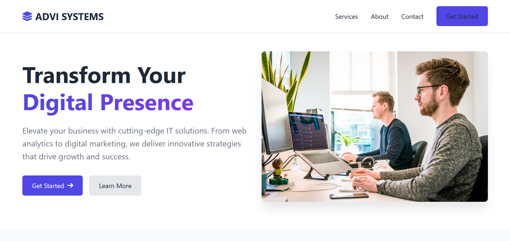
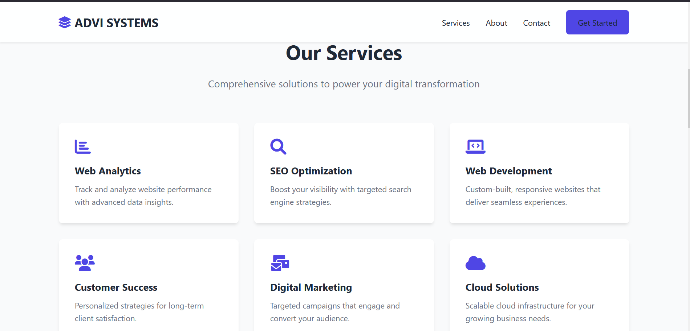

# ADVI-SYSTEM
ADVI-IT-Services

# ADVI Systems Website

A modern, responsive website built for ADVI Systems, an IT service company providing innovative solutions in web analytics, SEO, digital marketing, customer success, and more. This project is designed to enhance the digital presence of businesses with an engaging, professional website.

## Table of Contents
- [Project Overview](#project-overview)
- [Screenshots](#screenshots)
- [Features](#features)
- [Technologies Used](#technologies-used)
- [Getting Started](#getting-started)
- [Future Enhancements](#future-enhancements)
- [Contact](#contact)

---

## Project Overview
The ADVI Systems website is crafted to provide an intuitive and visually appealing user experience. The design showcases the company’s services and mission, with easy navigation and a clean layout that adapts well to different screen sizes.

The website includes:
- A hero section with a call to action.
- An overview of the services provided by ADVI Systems.
- A mission statement and core values in the About section.
- A contact form to reach out to the company.

## Screenshots

### Hero Section


### Services Section



## Features

- **Responsive Design**: Adapts seamlessly to desktops, tablets, and mobile devices.
- **Modern UI/UX**: Uses a clean and professional layout with smooth animations for a polished experience.
- **Detailed Service Information**: Clear and concise descriptions of each service offered by ADVI Systems.
- **Contact Form**: A functional form allowing visitors to easily get in touch with the company.
- **Interactive Navigation**: Simple navigation with links to all essential sections.

## Technologies Used

- **HTML5**: For structuring the content.
- **CSS3**: For styling, with custom properties and responsive design features.
- **JavaScript**: For interactive elements and dynamic features.
- **Font Awesome**: Icons for visual enhancement.
- **AOS (Animate on Scroll)**: Smooth animations that activate as users scroll.

## Getting Started

### Prerequisites
To get a local copy up and running, you’ll need:
- A code editor (like VS Code).
- Basic knowledge of HTML, CSS, and JavaScript.

### Installation

1. Clone this repository:
   ```bash
   git clone https://github.com/Akshat050/ADVI-SYSTEM.git
2. Navigate into the project directory:
   ```bash
   cd ADVI-SYSTEM
3. Open **index.html** in your browser to view the site.

### Usage

- **Local Testing**: Open the `index.html` file in your web browser to test the website locally.
- **Hosting**: You can host this project on GitHub Pages, Netlify, or any other static site hosting service.

## Future Enhancements

- **Backend Integration**: Add a backend to handle form submissions and manage user inquiries.
- **SEO Optimization**: Improve SEO practices to enhance search engine visibility.
- **Blog Section**: Include a blog for sharing articles and insights on digital transformation and IT solutions.
- **Analytics**: Implement Google Analytics to track visitor data and improve user engagement.

## Contact

For inquiries or collaboration:

- **Email**: [info@advi.com](mailto:info@advi.com)
- **Phone**: +1 (250) 123-4567
